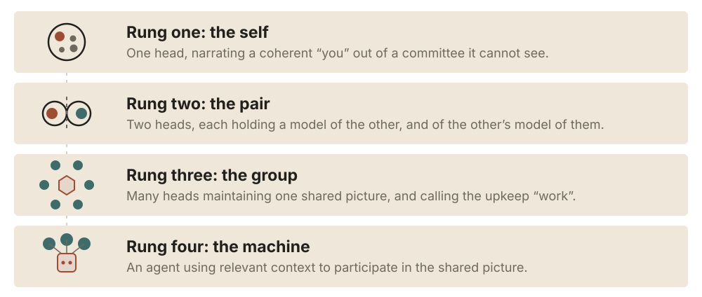
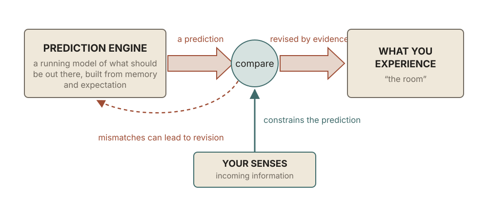
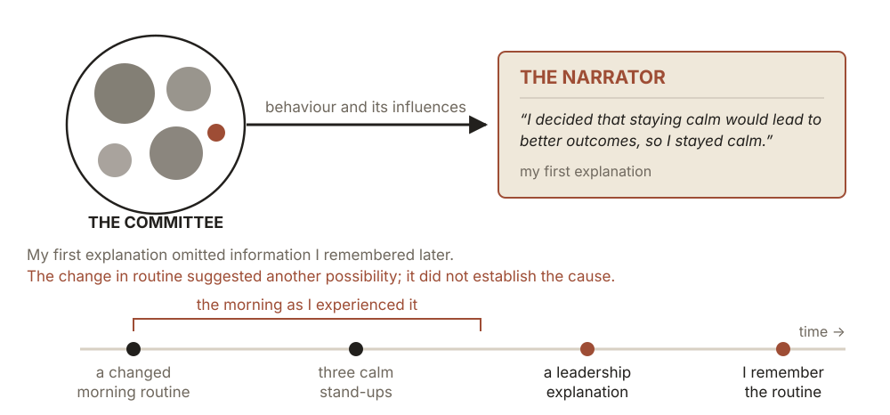
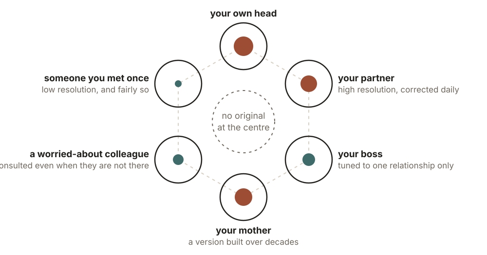
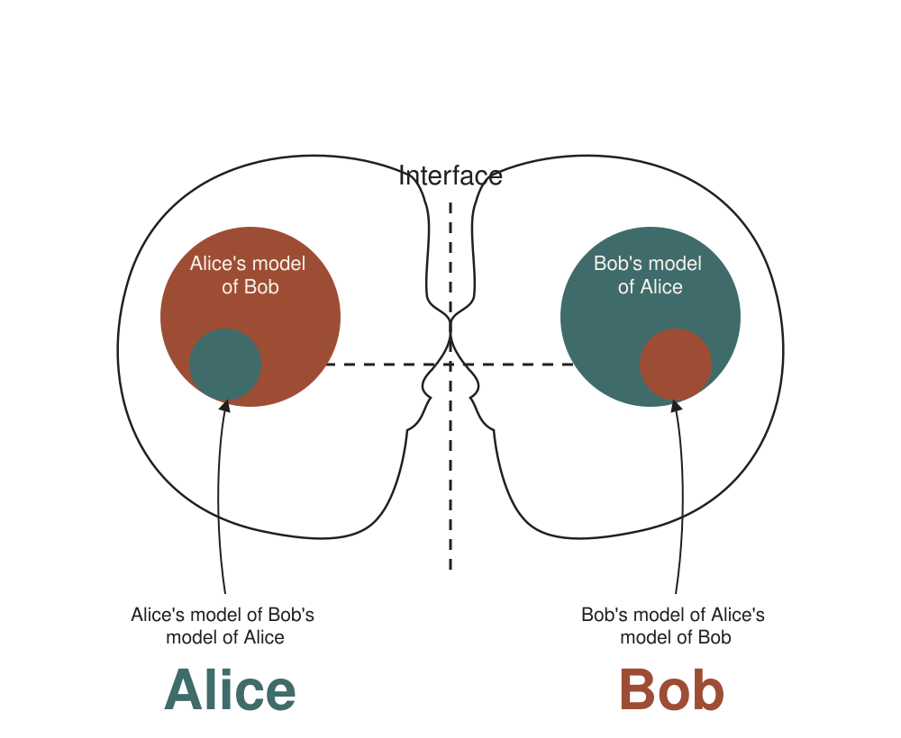
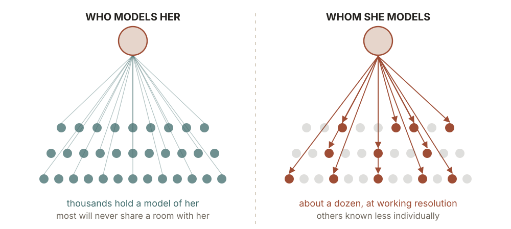
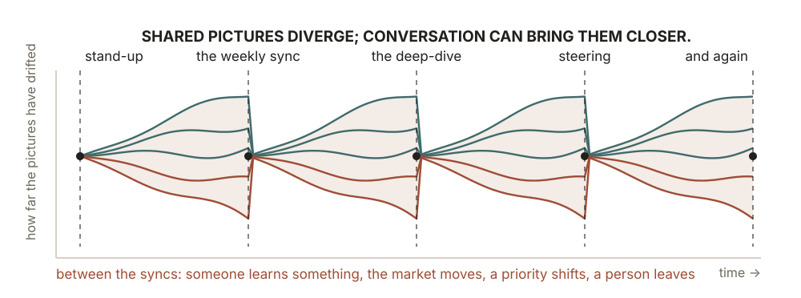
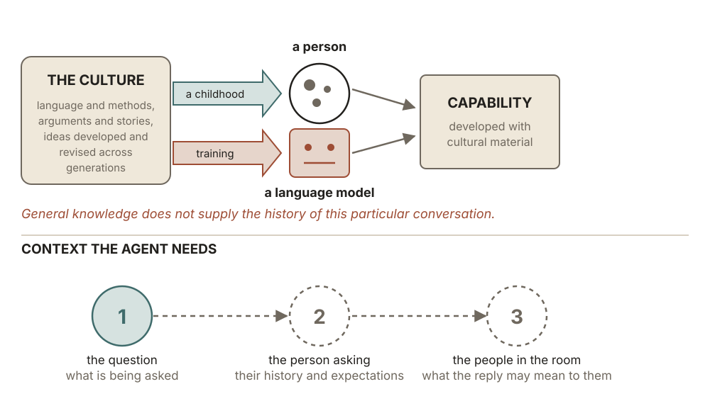
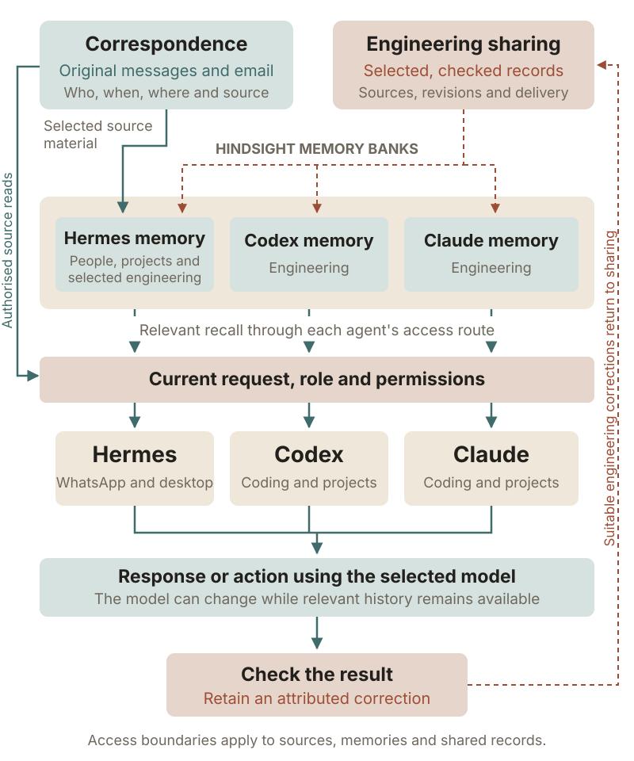

# **PEOPLING**
*How Minds Stay in Sync, and Why Everything Depends on It*

---

## Table of Contents

- Overview

**Part 1: Foundation**
*Understanding How This Actually Works*

- **Chapter 1:** Inside Your Head. Exploring You
- **Chapter 2:** Between Two Heads. Exploring Others
- **Chapter 3:** Across Many Heads. Most of Work Is Just Sync
- **Chapter 4:** The Smart Cultural Ghost. Exploring the Machine

**Part 2: Application**
*Solving for You and Your Organisation*

- **Chapter 5:** Solving for You. Meaning and a Congruent Self
- **Chapter 6:** Solving for the Corporation. Building Trust and Alignment

**Part 3: Implementation**
*Agents as Participants*

- **Chapter 7:** Peopling the Machine. Reading the Room

**Part 4: Synthesis**

- **Chapter 8:** The Path Forward

**Epilogue**

- The Universe Trying to Wake Up. The Philosophy Underneath

**Appendix**

- Quick Reference Framework

---

## Overview

A project can have a plan everyone has read and still have people working towards different things. The words are shared. The picture of what they mean is not.

A lot of what we call management is trying to close that gap. We explain, check, disagree, tell the story again. I think it helps to understand what we are actually doing in those conversations: building a model of what someone else understands, and giving them enough information to update it.

This is the part of working with people that interests me. It also connects to questions I have been thinking about for years: how we construct a sense of ourselves, how other people shape it, and what an AI needs if it is going to work alongside us.

Sarah Perry uses the word *peopling* for the activity of human beings going about their lives together. Her [essay on the subject](https://ribbonfarm.com/2015/04/08/the-essence-of-peopling/) explores how our sense of self develops through other people, and how rituals and shared information sustain that social world. I take that idea into the workplace, where understanding one another is a substantial part of getting anything done.

The book moves through four scales: yourself, another person, an organisation and an AI agent. First we look at how the models form. Then we look at what to do with them: bringing your own values into focus, choosing and working with people you can trust, and building systems that can carry useful context between you.

*Across these four scales, one person's understanding becomes part of a relationship, then a group's shared picture. An agent can help maintain that picture when it has the context and permission to do so.*

Shared understanding does not remove conflicting interests, a lack of resources or a difficult technical problem. It helps you see which problem you have. That is the practical promise of this book: a way to notice the assumptions people are working from, including your own, and do something about the gaps between them.

---

# Chapter 1
## Inside Your Head: Exploring You

When I was four, I thought Australia was in the clouds. My grandmother's plane had gone up into them, and she was going to Australia. Given the information I had, that seemed a reasonable place to put it. Later someone showed me a world map and the model fell over.

I wrote about that in my [Thoughtmash blog in 2010](https://www.thoughtmash.net/2010/12/server-terminal-analogy-for.html). What interested me was how convincing a model can feel while being wrong. We make sense of what we can see, and much of the work happens before we think to question it.

The models we build include a picture of ourselves: what we want, why we acted, who we believe we are. That picture can be useful and still leave quite a lot out. My own way into the question was through dreams.

## Reality is a controlled hallucination

Your experience of the world is shaped by memory and expectation as well as by what arrives through your senses. One way to understand perception is as an ongoing prediction, tested and revised against incoming information. Anil Seth calls this a [controlled hallucination](https://podcast.mindandlife.org/wp-content/uploads/2020/09/Anil-Seth_transcript.pdf): experience constructed by the brain, kept in contact with the world through sensory evidence.

*The model generates an expectation; incoming sensory information can correct it. The diagram shows that feedback loop, not a measurement of how much perception comes from either source.*

I have lucid dreamed since I was a child: dreams in which I know I am dreaming. In my mid-twenties I began keeping a diary and trying things out. A dream gave me a way to inspect an experience that felt like a world while knowing that the people and places in it were being generated in my own head.

The tests did not work the same way every time. Often I could fly. Text might look plausible until I tried to read it. A reflection could distort or become another character, and a stranger could change when I watched too closely. I recorded those variations in my [dream notes](https://www.thoughtmash.net/2010/12/dream-world-flaws-which-are-useful.html). They are observations about my dreams, rather than rules every dreamer must obey.

The comparison with waking life is what stayed with me. Awake, we still have to interpret what we encounter, but the external world keeps answering back. Another person can correct the version of them I carry. They can also surprise me in ways a model built entirely from my own expectations will miss.

## The committee in the driver's seat

In one lucid dream I was driving a four-wheel drive and decided to test what would happen in a collision. I steered straight into oncoming traffic. Do not try the waking version.

I remember three things happening together. I expected the other driver to react, but the car kept coming. I felt terrified even though I knew I was dreaming. Then the cars passed through one another without an impact. I wondered whether the dream had nothing in my memory to build a convincing crash from. That was my guess about what I had experienced, not a way to inspect what my brain was actually doing.

Calm expectation, fear and the knowledge that I was dreaming were all present, and they did not agree. That is why the committee image appeals to me. It captures the experience of several processes contributing to what feels like one person: thoughts, reflexes, feelings and expectations, sometimes pulling in different directions.

I recognise a quieter version at work when part of me wants a deal and part feels uneasy, without an explanation ready to hand. The unease is worth examining. It may register something I have missed, or it may be a reaction the situation does not warrant. Either way, the first confident account is not necessarily the complete one.

## The story is written after the fact

In [Benjamin Libet and colleagues' 1983 experiment](https://doi.org/10.1093/brain/106.3.623), electrical activity associated with preparation for a simple voluntary movement began before participants reported becoming aware of their intention to move. That is an interesting result. It does not, by itself, establish that every considered decision is made before we become conscious of it.

The interpretation is contested too. [Schurger, Sitt and Dehaene](https://doi.org/10.1073/pnas.1210467109) later proposed a model in which fluctuations in neural activity help explain the average build-up before these spontaneous movements. For this book, the useful question is narrower: how much of the explanation we give for a choice was available while it was forming, and how much arrived afterwards?

I caught myself doing something like this on a project I had been brought in to rescue. I was running several teams and usually talking at a hundred miles an hour. One morning I ran three stand-ups feeling unusually slow and calm. Afterwards I told myself that I had deliberately chosen a calmer approach because it would lead to better outcomes. A leadership choice. Mature of me.

Then I remembered I had skipped my coffee and taken L-theanine that morning. I cannot establish from one morning what caused the change. What interested me was that my explanation had arrived without considering either of those things. I had treated the calmness as evidence of a decision I was not sure I had made.

*The morning described above: behaviour, an explanation, then a remembered detail that unsettles the explanation. This is a personal example of revising a story about a decision, not a universal timeline of agency.*

Sometimes agency feels less like turning a steering wheel and more like being in a boat. The wind changes and you find yourself heading east, then decide east was where you wanted to go. Mood, habit, information and other people can all be part of that wind. Noticing them gives you something more useful to work with than assuming every movement began as a deliberate choice.

## When the explanation fills a gap

Confabulation is when you fill a gap in what you know or remember with an account you believe to be true. Here, the gap is in why you did something. You give a plausible explanation afterwards, without realising that it leaves out what actually prompted the action.

Neuroscientist Michael Gazzaniga studied this in people who had undergone surgery for severe epilepsy. Surgeons had cut connections between the brain's two hemispheres, including the main bundle of nerve fibres joining them, called the corpus callosum. These are the people described as having a split brain. The operation gave researchers a way to present information to one hemisphere without that information reaching the other through the usual route.

In one experiment, the researchers showed a picture of a chicken claw to the patient's left hemisphere and a snowy scene to the right. They then asked the patient to choose related pictures from a selection. The right hand, controlled by the left hemisphere, pointed to a chicken. The left hand, controlled by the right hemisphere, pointed to a shovel. Each choice made sense: the claw belonged to a chicken, and a shovel could clear the snow.

Then the researchers asked why the patient had chosen those pictures. The speaking left hemisphere could explain the chicken, but it had not seen the snow. In [Gazzaniga's account](https://mmp.planetary.org/scien/gazzm/gazzm82.htm), the patient explained the shovel by saying, "you need a shovel to clean out the chicken shed."

The explanation connected the shovel to the chicken because the chicken was the information available to the part of the brain answering the question. It supplied a reason that fitted, while missing the snowy scene that had prompted the choice. That is what makes the example useful here: someone can sincerely explain their own action without knowing what caused it.

The ordinary version is familiar: we reach a conclusion and then become much better at explaining why it was the right one. Sometimes that explanation is sound. Sometimes it is a story that makes an existing preference easier to live with.

A useful habit is to ask what information would change your explanation, especially when it is unusually flattering to you. If different parts of your reaction do not line up, slow down before smoothing them into a single account. An unresolved question may tell you more than a neat justification.

There is a useful comparison with the fluent but fabricated answer a language model can produce. Human confabulation and a model's false answer need not have the same underlying mechanism for the comparison to matter. In either case, an explanation sounding right is a poor substitute for checking what supports it.

## You are the story, and you are not the only author

If some of your sense of self is a story you keep revising, there is room to work on it. You can question the account you give of a bad day, notice a pattern in how you respond, or decide that a familiar role no longer fits. That is the possibility I want to carry into the later chapter on meaning and a congruent self.

The account changes with experience. A bad night's sleep, an argument at breakfast or a small win at work can alter the way you see yourself for the rest of the day. You may recognise that shift before you can explain it. The committee image helps me remember to look for influences that the official story has left out.

And the story is populated. There is the version of your boss you consult before sending an email, the partner whose reaction you anticipate, the colleague you are worried about. You can rehearse an entire conversation without the other person being there. That is where the question moves from your own head into a relationship.

---

# Chapter 2
## Between Two Heads: Exploring Others

Think about the last time you rehearsed a difficult conversation. You supplied your own words and the other person's likely answer. The accuracy of that rehearsal depended on the model you had built of them.

When the conversation happens, the person has a chance to surprise you. The important question is whether you let that surprise change the model.

Go back to the dream. The version of your partner who appears there is built from your own memory and expectation. They may do something recognisable, or something the real person would never do. Awake, you still interpret what your partner says and does through what you already know of them. But now someone independent of your expectations can answer back. You have a chance to find out where the model is wrong, provided you notice the correction.

Many misunderstandings begin in that gap: what I expected you to mean, and what you were trying to say.

## A person is a verb

The cleanest way I know to put it comes from an essay by Sarah Perry on the essence of peopling, and the thing that cracked it open for me was a point of grammar. She treats people as a verb, not a noun. A noun gives you a snapshot, a body standing there doing nothing in particular. The verb gives you what people are actually up to. Peopling is the whole catalogue of it: greeting, gossiping, joking, trading, flirting, mourning, jockeying for position. It looks like a thousand separate activities. Perry's claim is that they all run off one engine, and the engine is that we run on each other.

We usually picture it the wrong way round. We imagine a sealed self inside the skull that then, as an optional second step, learns to deal with other people. Perry, following the psychologist Philippe Rochat, says it runs the other way. You do not start as a private self and reach outward. You get built into a self by other people being aware of you, the way you only ever learn your own face from a mirror. Descartes handed us "I think, therefore I am," the lone mind proving its own existence in an empty room. The older and truer version is "we think, therefore I am." The room comes first. The self precipitates out of it, like salt out of water left in the sun.

So who you are is not one thing in one place. It is distributed. There is the you in your own head, and a version of you in your partner's head, another in your mother's, another in the head of someone you met last week. Each runs at a different resolution and behaves a little differently, exactly like those dream characters, because each is tuned to one particular relationship. You are one person with your mates, another with your parents, another on a first date. None of those is the real you wearing costumes. The self lives across all of them at once, and in the switching between them.

*You are not one thing in one place. A version of you runs in every head that knows you, each at the resolution that relationship has earned, and none of them is the real you wearing costumes.*

## The recursive mirror

Now make it precise. Coordinating with another person is not just me holding a model of you. It is a stack. My model of you. My model of your model of me. Your model of me. Your model of my model of you. And on down. In theory it runs to infinite recursion, the other person thinking that I think that they think. In practice, we cannot keep that whole stack in mind. The first few levels are already enough to make a conversation complicated.

*Inside each person's model of the other sits an expectation of how the other sees them. Words, tone and timing cross the gap and can correct those expectations.*

The diagram makes it concrete. Inside Alice's head sits her model of Bob, and nested inside that, her model of Bob's model of her. Bob holds the mirror image. The two never touch directly: they meet at an interface, each working from the doll within a doll they carry of the other. What matters about any of these models is its fidelity, how closely it predicts the real person it stands for. A high-fidelity model lets you call what someone will do before they do it. A low-fidelity one keeps getting caught out. The deeper you go, the more guesses you may be building on other guesses. That is one place to look for the source of a misunderstanding. It will not explain every conflict: you can understand someone accurately and still want different things.

That second level matters when deciding how to speak. Alongside what someone wants, you consider what they think you understand, what they expect from you and how your reply may change those expectations. A factually correct answer can still fail to address the concern behind the question.

Holding these models can be tiring. I notice the cost in trying to remember names, places and who said what, the social fabric other people seem to carry more easily. I am a strong in-the-moment thinker, but I do not reliably retain all of that history. Whether that reflects wiring, habit or a choice somewhere along the way, I know there is a limit to what I can keep in view.

There is a sharper reason it costs so much. The you that you carry from the inside runs warm and flattering, the lead in your own footage. The you that lives in other people's heads is cooler and more ordinary, a minor character in theirs. The two readings never reconcile, because they are built from different information and neither can audit the other's books, and the gap between them is more or less what self-consciousness is. Attention makes it worse: the more you watch yourself being watched, the wider the gap opens, which is how a flash of self-awareness can spiral into the cringing kind that strangles whatever you were trying to do. Peopling does not hurt by accident. The ache is the cost of holding both selves at once.

There is a name for this whole structure, a loop that turns back on itself until a self falls out of it. Douglas Hofstadter called it a strange loop: a system that gets complex enough to model itself modelling itself, and in the closing of that loop an "I" appears. The recursion in this chapter is that same loop pointed outward, at other people rather than at yourself. Keep the name. It returns before the chapter is out, and again at the very end of the book, because the loop that builds a self is also the one that lets a self keep running on a brain that was never its own.

## Other ways of imagining the self

The image of a private individual directing everything from inside a skull is one way of understanding agency. Other traditions put more emphasis on the relationships and forces acting through a person.

There is a very direct example in the Iliad. Diomedes is a Greek warrior fighting at Troy, and Athena gives him courage for the battle. Samuel Butler's translation calls them Diomed and Minerva. Book V opens:

> Then Pallas Minerva put valour into the heart of Diomed, son of Tydeus, that he might excel all the other Argives, and cover himself with glory.

Later in the battle, an archer wounds Diomedes in the shoulder. His companion pulls out the arrow, and Diomedes prays to Athena for help against the man who shot him. She answers the prayer, makes his limbs supple and tells him:

> Fear not, Diomed, to do battle with the Trojans, for I have set in your heart the spirit of your knightly father Tydeus.

The change then shows up in what he does:

> When she had said this Minerva went away, and the son of Tydeus again took his place among the foremost fighters, three times more fierce even than he had been before.

Those are the words of [the Iliad, Book V, in Butler's translation](https://en.wikisource.org/wiki/The_Iliad_of_Homer_(Butler)/Book_5). Courage is something the goddess puts into him. He is wounded, asks for help, receives it and goes back into the fight. The story gives the change in his capacity to act a presence and a voice of its own.

The story of Saul gives another version of something arriving in a person and changing how they act. Saul's servants suggest finding a musician to help when an evil spirit troubles him. David is brought to the king and plays for him. [The account describes what happens](https://www.biblegateway.com/passage/?search=1+Samuel+16%3A14-23&version=KJV):

> And it came to pass, when the evil spirit from God was upon Saul, that David took an harp, and played with his hand: so Saul was refreshed, and was well, and the evil spirit departed from him.

Later, the music is part of a much darker scene. David is playing while Saul sits with a spear in his hand. [The story continues](https://www.biblegateway.com/passage/?search=1+Samuel+19%3A9-10&version=KJV):

> And the evil spirit from the Lord was upon Saul, as he sat in his house with his javelin in his hand: and David played with his hand.
>
> And Saul sought to smite David even to the wall with the javelin: but he slipped away out of Saul's presence, and he smote the javelin into the wall: and David fled, and escaped that night.

Saul tries to pin David to the wall. David escapes, and the spear strikes the wall instead. The earlier passage describes Saul becoming well as the spirit departs; this one places the spirit's presence alongside his violence. The language pictures a person as open to forces that can arrive, act through them and leave.

That is what interests me in these stories. I recognise the experience of a mood arriving before I have an explanation for it, or of another person changing what I feel capable of doing. The stories give that influence a form. They do not let us establish exactly what an ancient person experienced from the inside.

In the interviews behind this book I wondered whether Protestant theology helped strengthen the more individual-centred picture I grew up with. That is a historical hunch, not a complete account of where the modern self came from. The point I want to keep is that the picture can be questioned. It is possible to take individual judgement seriously while also asking how a person's relationships help form it.

Bakunin offered a political version of the social self: our awareness of ourselves is reflected through the people around us, and freedom depends on the freedom of others. His [discussion of the individual and society](https://www.marxists.org/reference/archive/bakunin/works/1871/principle-of-the-state.html) makes recognition part of freedom rather than a limit placed on an otherwise complete, isolated person. That is another route into the relationship this book is exploring.

## Carol, who kept running

Douglas Hofstadter pushes the distributed self about as far as it will go, and he does it through grief. In *I Am a Strange Loop* he writes about his wife, Carol, who died suddenly when their children were small. His way of living with it is not a consolation, it is a claim about what a person actually is. A person, he argues, is a pattern, not a lump of matter, and a pattern can run on more than one brain.

Over their years together, a low-resolution copy of Carol had been installed in him. Her values, her way of seeing, the precise way she would have reacted to a given thing. When she died, that copy did not switch off. It kept running. He could still feel her weigh in on a decision, still catch the world for a moment through her eyes, because a real part of who she was had always lived in his model of her, and that part survived the loss of her body. It is a coarser version than the one that ran on her own brain. It is still, recognisably and genuinely, her.

Hofstadter is making a claim about the continuity of a person through patterns held by others. Whether you take that literally or as an account of how someone continues to shape a life, the experience is recognisable.

Even alone, you may consult a parent, mentor or friend in your imagination. The response you supply can help you test an idea against a perspective other than the one currently uppermost in your mind.

At an extreme, Joshua Slocum described a vivid imagined companion during his solo voyage: while ill, he experienced a visitor who identified himself as the pilot of the Pinta. His [own account](https://www.gutenberg.org/files/6317/6317-h/6317-h.htm) is memorable, but it should not be made to prove a general theory of who survives isolation.

The smaller, everyday claim is enough: conversation with an imagined other can do useful work. It can also repeat your own assumptions, because you are supplying both sides. Contact with an actual person offers something the rehearsal cannot guarantee: a correction you did not write yourself.

## Models with nobody home

Once you see it, you catch yourself doing it constantly, with people who are not in the room and a few who are not anywhere. You ask yourself what your father would make of a decision. What a mentor would say. What Jesus would do. You are regulating your own behaviour against a model of a person who is not present, and it works, because the model is doing the work, not the person. A great deal of religion is exactly this: a high-resolution model of someone you revere, kept running and consulted before you act. The prayer, the re-reading, the weekly gathering, those are not separate from the model. They are maintenance on it, the same upkeep a friendship needs, because a model you stop feeding will drift and fade.

And it is the same machinery whether the other person is alive across town, long dead like Carol or never real in the first place. We are built to keep other people partly alive inside us and to let them steer what we do. Which, when you actually sit with it, is a strange and slightly miraculous thing for a brain to be doing, and we do it without noticing, all day long.

## Trust needs more than a good model

Maintaining a relationship includes keeping those models current. Ritual and regular contact give people opportunities to notice what has changed. Without them, you can find yourself responding to someone as they used to be, or as you assumed they were, while missing the person trying to speak to you now.

A higher-fidelity model of someone tells you more about what they are likely to do when you are not in the room. That matters for trust, but it does not constitute trust by itself. You can know someone very well and know perfectly well that you should not rely on them. The better model might be the reason you decide not to work together.

You also need an alignment of values, enough common ground about what matters and how you treat each other. If I care about keeping a promise and you think a promise expires when a better offer arrives, understanding you more accurately will not close that gap. We do not have to agree about everything. We need enough alignment around the things the relationship depends on for me to be comfortable relying on you.

That is part of what the long dinner that barely mentions the deal is for. The apparently random talk gives you a richer model of someone, and it gives you a sense of what they actually value. Over time, their choices tell you whether that picture holds. Sometimes you discover that you want to work together. Sometimes you discover why you do not.

The information still has to cross the same narrow channel between two heads: language, expression, tone and time spent together. Every conversation gives the model another chance to be corrected. Widen that channel and you can learn more about the person, a thought worth holding onto for the end of the book. What you learn is not guaranteed to make you trust them more.

And because the modelling runs both ways, you do not hold your own shape on your own. Spend enough time with someone and the two of you converge, each quietly editing the other's model and, over time, the other's self. Their habits, interests and ways of thinking can become part of yours, which is a good reason to be deliberate about who they are. You are not just choosing company. You are choosing who gets to reshape you.

There is a name for what all of this amounts to, and it is worth stating cleanly before we scale it up. Personhood is a coordination layer. It is the protocol the group runs so that separate minds can predict each other well enough to act together. The self does not emerge first and then join the group. It emerges because the group needs something stable enough to model, and what it models into existence is you. Every piece of the machinery we have walked through in this chapter, the recursive mirrors, the dream-characters, the trust built over years of contact, is the coordination layer doing its work, turning the noise of a human animal into something another human animal can rely on.

A team makes the problem harder. People need enough understanding of one another to work together, while also keeping track of a project no single person sees in full. That is the next scale to consider.

---

# Chapter 3
## Across Many Heads: Most of Work Is Just Sync

In a team, the models include relationships, responsibilities and a picture of the work itself. As the group grows, it needs ways to hold information that people can no longer maintain through personal contact alone: plans, roles, meetings and shared accounts of what matters.

## You don't have a personality, you have one per room

Start with Perry's version of the multiple self, because it scales straight up into organisational life. Each person, she writes, has a different self for each of the people he knows, and a different self for every social context. A teenager behaves, speaks and thinks one way around his friends and an entirely different way around his grandparents. The self at work is not the self at home with close friends, or in bed with a partner. None of these is the true self; the self exists in all of them, and in the transitions between them. To collapse them all into one flat public self, she says, would be a kind of social death.

Perry talks about selves and contexts, and that is exactly the right frame for organisational life. You do not have one personality at work, you have one per room. There is a finance-director self, a worried-about-the-board self, a mentor-to-the-juniors self, and they are genuinely different people, with different voices and different things they care about, because each is tuned to a different group. This is not you being fake at work. It is what having a self among many groups actually looks like. The trouble only starts when one of those selves stops being something you inhabit and hardens into a costume you wear, and we will get to that.

## Status is the thing everyone is actually tracking

The next thing that scales up is status, and Perry is sharp on it. We do not model everyone equally. We spend our modelling budget by position. Our social superiors, the ones with power over us, get a large share of it. So do our possible enemies. And so, in particular, do the people just below us on the hierarchy who may be jockeying for our position, who have to be simulated in detail precisely because they are coming for the rung we are standing on. Maintaining your own accurate place in that web, Perry says, including your status and your relationships, is the core task of being human.

Scale that up and you can see an asymmetry in a hierarchy. Thousands of staff may carry a model of a chief executive who knows relatively few of them individually. They need to anticipate her decisions; she cannot give each of them the same attention. An org chart tells you something about that unequal need to understand other people. A restructure can disturb it, leaving people to work out whose judgement matters and what the new relationships mean.

The asymmetry has a darker setting in public shaming. A crowd can hold a flattened, hostile picture of someone who cannot answer each person or correct each version. The person becomes intensely visible without being well understood. That is another reason to distinguish the attention a person receives from the fidelity of the models people hold of them.

*An illustrative hierarchy: many people attend closely to one person who knows fewer of them individually. The numbers show the asymmetry, rather than a measured rule about executives.*

I first noticed a simpler kind of hierarchy on a farm. As a kid, I moved cows between paddocks and watched them fall into a familiar order: a head cow, a second, then the rest behind. It made me wonder how much leadership is about filling a role the group needs. Somebody establishes a direction and the others respond. A herd does not explain an organisation, but the memory helps me question the idea of leadership as something that belongs entirely to an exceptional individual.

This is the coordination layer from the last chapter showing its other face. The same process that builds a self also limits it. To be someone the group can coordinate with, you have to be someone the group can model, and that means staying roughly where they put you. The modelling budget is not free: people spend it on you, and the unspoken return is that you remain predictable enough to justify the investment. Change too fast or too far and you force everyone around you to rebuild their models from scratch, which is expensive, which is why they will push back. The coordination layer does not only produce the self. It polices it. Personhood is the price of being legible enough for others to work with, and the price is that other people get a quiet, persistent vote on who you are allowed to be.

## The corporate skinsuit

Here is where one of those selves can curdle, and Perry has the perfect word for what it becomes. She describes the bureaucrat you have to deal with as a skinsuit: the suit the corporation or the agency wears, with no co-modelling, fully present person inside it. You have met this person. You have, on a bad week, been this person. Someone shows up as the stiff corporate version of themselves, nothing like who they are at the pub, and holds that rigid shape all day.

I think this helps explain why companies put so much effort into values statements. They are trying to give the work-self a common set of expectations, so people can cooperate without first learning everything about one another. There is a useful shortcut there. You can know very little about a colleague's private life and still expect them to keep a commitment or tell you when something has gone wrong.

The cost arrives when the work-self is a rigid performance of values the person does not actually hold, or that the company says it holds and quietly rewards people for ignoring. Then the suit conceals the disagreement instead of helping people work through it. You get the low hum of dissonance in the person wearing it, and uncertainty in everyone trying to work out whether the stated values mean anything. The later chapters return to both sides of this: how much of yourself you need to perform, and how a team establishes values it can actually rely on.

## A company is a shared hallucination you maintain together

Once a group gets past a certain size, symmetric modelling simply breaks. You cannot hold a live model of five hundred people each holding a model of you. Even between two people, the recursive models are difficult to maintain. At organisational scale, people need other ways to coordinate. So the group does what humans always do with something too big to model directly. It builds a shared entity and points everyone at that instead.

The company, the brand, the mission and the project give people common things to orient themselves around. Perry uses the word *egregore* for an entity sustained in the thoughts of a group that can, in turn, influence the group. A company offers a practical example: people carry different accounts of what it stands for and try to act on its behalf. Calling it a shared hallucination draws attention to that collective work of imagination. The contracts, assets and people are real; the common purpose depends on people continuing to recognise and participate in it.

The crowds in my dreams offered an image for this. I often experienced the crowd as having one mood or direction, without being able to interact with its members individually. An organisation can also be encountered as a collective with its own momentum. The comparison helps describe that experience; it does not mean the individuals inside a company disappear or behave like dream characters.

## Most of work is just sync

Sit through a week of corporate meetings and watch how much time goes into getting people to understand the same thing. The stand-up, the status update, the technical deep-dive: each can exist so people leave with a clearer picture of what is happening and what to do next. I have sometimes put the proportion at ninety percent. That is an impression from my working life, not a measured statistic. The point is how easily we treat coordination as an interruption while depending on it all day.

And the picture will not hold still. The moment you have everyone aligned, someone learns something new, the market moves, a person leaves, a priority shifts, and the shared model immediately starts drifting apart again. In a technical field it is worse, because the thing you are trying to get from one head into another is genuinely hard to explain, so the cost of keeping it synchronised climbs. You are not failing at your job when this eats your week. This is the job. We just never named it, so we treat the thing that consumes most of the working day as an interruption to the real work, when it is the real work.

*New information and changing circumstances pull people's pictures apart. A useful conversation can bring them closer again; a meeting only helps if it changes what people understand.*

Think about a live traffic map. Information from many journeys can contribute to a picture no single driver holds. You cannot see the jam four streets ahead; a map may help you act on it. That is the comparison I have in mind for shared context: separate contributions assembled into something useful beyond the person who supplied them.

Maps makes the coordination visible. Each driver contributes to a picture nobody could assemble alone. In an organisation, the information is also distributed, but much of the effort goes into repeatedly reconstructing it in meetings. That suggests a useful job for a system that can retain and retrieve the shared record.

## Teams form by renegotiating who everyone is

This is also why a team cannot simply be assembled and switched on. Drop into a project that has gone sideways and you watch a group march straight through the old textbook stages, forming, storming, norming, performing. The storm gets blamed on personalities, but it is not really personalities. It is everyone re-adjusting who they are relative to everyone else, rebuilding the status hierarchy and working out who each person is going to be inside this particular group, until the group settles into something that can actually run. It looks like friction. It is personhood being negotiated in real time, the selves and the status from the start of this chapter all getting sorted out at once.

And the thing that makes a settled team fast is the thing we called trust in the last chapter, now scaled across a group: models of one another good enough to predict what each person will do when you are not watching, together with enough shared values to be comfortable relying on those choices. That helps explain the value of a person who can get an idea cleanly from one head into another. The strongest communicator and the strongest individual executor may be different people. The team depends on both.

## We used to get this for free

Shared experience used to do some of this maintenance without a calendar invitation. When you spend time alongside people, you pick up how they work and what they mean through ordinary contact. A distributed team has to create more of those opportunities deliberately. Tickets and scheduled calls carry important information, but they may leave little space for learning the person behind the role.

I see a version of this outside work too. People can be well connected and still spend their days inside very different information environments. Each person's feed supplies a picture of what matters that others may barely recognise. I do not know how much of the apparent fragmentation is the world changing and how much is my own feed talking. That uncertainty is part of the problem: even an impression of the shared picture comes from somewhere particular.

The idea sometimes described as a cult of the self interests me here: the pressure to maintain an individual identity for an audience. It can consume attention without producing the experience of being understood. The question for this book is practical. Which relationships give you a chance to be recognised and corrected, and which merely keep you performing?

Perry describes the difference between going unrecognised and feeling socially substantial, held in other people's understanding without constantly having to establish who you are. A familiar community can provide that feeling. So can a team or friendship built over time. Formal connections alone do not guarantee it.

The useful skill is being able to follow a perspective you disagree with well enough to understand why someone holds it. Agreement may remain impossible. At least you then know where the disagreement is, instead of arguing with a position the other person does not recognise.

What happens when an AI joins that exchange? It may know a great deal about the subject while knowing very little about the people and the history behind the question.

---

# Chapter 4
## The Smart Cultural Ghost: Exploring the Machine

A model can give a capable answer and still have no useful picture of the situation it is answering into. It may not know what this team decided last week, why someone is asking again, or what they already understand. That is the gap I want to explore, but first there is a question about where its capability comes from.

## The culture is part of the intelligence

When a machine does something clever, it is tempting to look for a clever individual inside it. I think that overlooks how much of the intelligence on display comes from the culture it has learned from. We make a similar mistake when we give an individual human all the credit for what they know.

A child inherits language, stories, methods and distinctions that took many people a long time to develop. I can reason about things I could never have discovered alone because other people have made those ways of thinking available to me. Individual ability matters, but it operates with material supplied by a much larger collective effort.

A language model comes to that material by a different route. Training on human-created records gives it access to patterns in the language and work of other people. That is not the same process as a childhood, but the comparison helps me notice the cultural contribution in both cases. Intelligence is partly in the library we share, not only in the person consulting it.

The relationship goes both ways. We use language to express thought, and the language we inherit helps shape what we can express. A friend once pushed back when I called people mouthpieces for cultural intelligence: surely language was the mouthpiece for our intelligence. I think both directions matter. We absorb, use and change the common material.

## A smart cultural ghost

That is the image I have in mind when I call a language model a smart cultural ghost. It can draw on an enormous amount of human expression and speak in many registers without having lived the experiences it describes. The phrase helps me keep its fluency and its unfamiliarity in view at the same time.

The old idea of a spirit speaking through someone offers another way to picture that. A voice can carry more than the experience of the individual producing it. I am borrowing an image, rather than claiming ancient people would have understood modern computing. What interests me is the possibility of useful participation without first settling what, if anything, is being experienced inside the participant.

## What we can ask it to do

My own hunch is that the model is something like a philosophical zombie: capable of producing intelligent behaviour without subjective experience. That is a view about an unresolved question. It is not something the system's performance establishes, and the practical argument here does not depend on proving it.

The questions I can do something with are more specific. Can it hold relevant context? Can someone correct it and have that correction survive the conversation? Can it explain what evidence it used? Can it keep one person's information out of a room where it does not belong?

Those are parts of what we ask of a reliable participant. Thinking of personhood in terms of these social functions gives me a way to investigate the system by building and using it, while leaving the question of experience open.

## What the ghost has not been told

The model may have learned a great deal about people in general. That does not mean it knows the history of these people, in this project, at this moment. It can infer something from the question and whatever else is in the conversation. The missing information may be the reason the question was asked at all.

Think back to the nested models in chapter two. To respond usefully, an agent may need a picture of the asker, their expectations of the agent, and what the reply is likely to do in the group. A system supplied with that context can attempt the task. A system that has never received it may fill the gaps with plausible assumptions.

*Training supplies general patterns. The people, history and expectations of this particular conversation require additional context. The lower row shows information a system may be missing, rather than a fixed limit on what a model can do.*

That difference is the starting point for the agent in chapter seven. Before building it, I want to look at the human side of the problem: how to become clearer about your own values, and how a team develops enough shared understanding to act together.

---

# Chapter 5
## Solving for You: Meaning and a Congruent Self

You can spend a day in meetings doing two jobs at once. There is the project, and then there is keeping track of who you think each person expects you to be. You tailor what you say to a guess about the version of you in their head. That second job can be exhausting.

Some of that attention helps the conversation. Some of it goes into winning approval or maintaining a position you no longer believe. I think it is worth finding out which part is costing you, because having several different selves is not, by itself, the problem.

## Different relationships need different parts of you

Sarah Perry makes the limit explicit in [The Essence of Peopling](https://ribbonfarm.com/2015/04/08/the-essence-of-peopling/):

> There can never be one single, public self; to collapse all these multiple selves together would be akin to social death.

Her point is that a self exists across relationships and in the movement between them. None of those versions has an exclusive claim to being the real one. The differences are part of what makes each relationship possible.

Being a colleague, a close friend and a partner involves different kinds of attention and intimacy. Privacy matters. So do the responsibilities of a role. There are things you can properly share with one person that would be out of place with another. A professional manner can be useful and sincere, even when it is quite different from how you behave at home.

There is also a limit to what you can settle on your own. Other people have their own histories with you. They will keep different pictures of you, and you cannot make those pictures identical by deciding to be more consistent.

So the change I am interested in is narrower: reducing the contradictions you keep alive to satisfy different audiences. Congruence, as I mean it here, is being able to stand behind your commitments across situations, while accepting that the situations ask different things of you. Some tensions will remain because the demands really do conflict.

## Choose the conflicts worth changing

I see the distinction most clearly in consulting. Agreeing with the client can feel like helping until you find yourself supporting a direction you believe will fail. Then you are doing the work while keeping your judgement out of it. A useful change is to explain the concern and what it is based on, in a way the client can hear. That still takes tact. It also leaves room for the client to know something you have missed.

A friend gave me an image I like: she thinks of herself as a planet, with a core and looser layers around it. Different people draw different material to the surface. It makes room for both stability and variation. I can want my commitments to be dependable without expecting every conversation to bring out the same part of me.

Conviction helps when it is supported by reasons you are willing to examine. It gives people something they can learn about you. It need not mean defending yesterday's position after the facts have changed. Being able to explain why you changed your mind may make you easier to trust than performing certainty.

I have spent years bringing my work personas closer together, and I find it less mentally taxing. That is a useful result for me, rather than a prescription to expose every part of yourself at work. It has also been easier with a reputation and a body of work behind me. Someone whose position is less secure may have good reasons to be more guarded.

There are costs either way. Speaking more plainly can reveal a disagreement that politeness had kept out of view. You may discover that a role asks you to support something you cannot stand behind. That is a real choice about the work or the relationship, and no amount of consistency makes it disappear. Nor does everyone who understands you have to share your values.

## Give the projects a direction

The more useful question, especially where the selves cannot be brought together, is what connects the things they are doing. In a supplementary interview I put it this way: at least try to bring the meaning together.

I know the pattern of finishing a project, finding myself with time available, and looking for another thing to keep my mind occupied. Busyness makes it easy to avoid asking what any of it is for. The next task supplies an answer just long enough to get started again.

The computing analogy that came to me was a sub-agent. Each project loads a subset of you and points it at a goal. You can be very effective inside that task while the wider question goes unattended. I called that being AFK, away from the keyboard, in your own life.

You cannot keep every part of yourself active at once. What you can do is occasionally step back from the task and ask how it fits with something you care about beyond completing it. Would it still matter if nobody were waiting for the result? What part of your life keeps getting postponed while you finish one more thing?

Meaning does not have to be one grand purpose shared by every role. You may care about doing useful work, being present for people you love, and making something simply because it interests you. Those purposes can support one another, but sometimes they compete. Naming the trade-off is more useful than pretending everything serves a single mission.

The point is to have some say in what your activity adds up to. A company's goal may be worth working towards, but it cannot answer every question about what matters in your life. Finishing the project should leave you with more than the need for another project.

That brings us to the people you work with. How do you build a team in which different people can contribute to a shared purpose without having to become the same person?

---

# Chapter 6
## Solving for the Corporation: Building Trust and Alignment

A team brings together people with different histories, priorities and assumptions. You can be clear about your own values without knowing how everyone else will respond under pressure. Leadership involves learning those differences and building enough shared understanding to work with them.

Some of that work happens in a project meeting. Some happens in a conversation that barely mentions the project. Both can matter. The useful distinction is whether the contact helps people understand, decide and act, rather than whether it looks productive on the calendar.

I want to look at trust and values first, then the everyday contact that maintains them, and finally how a group develops a shared picture of its work.

## Trust needs understanding and shared values

For the kind of trust I want in a team, start with the two parts we separated in chapter two: a good enough model of someone to understand how they are likely to act, and enough alignment of values to be comfortable relying on them. More contact helps you learn who they are. It does not guarantee that what you learn will make you want to work together.

A shared vision gives you a picture of what you are trying to do. Shared values matter when you have to choose how to do it, especially when something goes wrong or two priorities collide. You can agree completely about where the project should end up and still disagree about whether it is acceptable to hide bad news, break a promise or leave someone else carrying the cost.

This is why sales involves long dinners that barely mention the deal, and why companies arrange team-building activities unrelated to the work. You get to see more of someone than the version who turns up with a status report. The apparently random conversation helps you build a higher-fidelity model, including a sense of what they value. That makes it easier to judge whether you want to rely on each other. The dinner can help you discover alignment; it cannot manufacture it just because you both enjoyed yourselves.

Values also have to survive the incentives people face. A team can share a vision and sincerely endorse the same principles, yet reward each person for decisions that make someone else's job harder. When a KPI rewards withholding information or protecting your own result at the group's expense, a dinner will not fix the problem. People are learning from what the organisation rewards as well as from what their colleagues say.

## What a values statement is trying to do

A company cannot wait for everyone to build a detailed model of everyone else before anything gets done. I think that is part of what its values statement is trying to shortcut. It gives people a common account of how they are expected to behave at work: keep your commitments, be honest about mistakes, take responsibility for the effect you have on others. A new colleague is meant to arrive with some of that alignment already in place.

In the language of chapter three, it is aligning the values of the corporate skinsuit. You might be thoroughly depraved outside work, but the company still expects the version of you that turns up on Monday to follow the same rules as everyone else. It does not have to reconcile your whole private life with theirs. It is trying to make the work-self something other people can rely on.

But it is better when the values hold outside work as well. Then the company is asking you to act in a way that already makes sense to you, and your colleagues can rely on something that belongs to the person as well as the role. You have less to perform, and they have less reason to wonder which version of you they are dealing with. That is the connection back to the congruent self: the smaller the gap between your values and the values your work asks of you, the less energy goes into maintaining it.

The statement is still a useful starting point, provided the words describe what actually happens. If the poster says honesty and the person who raises a problem gets punished, people learn from the punishment. The values that matter are the ones that show up in decisions, particularly when following them costs something. A statement can give you an initial model of what to expect. Working together is how you find out whether it was accurate.

## Other ways of binding a group

There are other ways to create confidence that someone will not betray you. Consider a gang that requires a new member to commit a crime. The act can create shared exposure: each person now has something to lose if the arrangement falls apart. An initiation or hazing ritual can serve a related purpose, making membership costly and giving the group a shared experience or secret. Where people cannot afford to have that secret exposed, betrayal becomes expensive. It is a shortcut to a particular kind of trust, built by tying people's interests together.

The point is the binding mechanism. Shared exposure can make people rely on one another without first building a detailed model of each other's values. It does not make betrayal impossible, and it does not tell you how they would behave once the cost of leaving changed. The arrangement is doing some of the work that, in another relationship, shared values would do.

A cult of personality gives a group another point to align around. A founder or CEO can become the person who carries the vision and embodies the values, especially in a startup where so much of the company is still an extension of its founder. You might barely know the person beside you, but you both believe in the leader, and that gives you a starting reason to believe in each other. The many-to-one pattern from chapter three is doing the coordination: everyone can model the same person without first modelling everyone in the company.

That can bring people together quickly, but it matters what their loyalty is attached to. If it is attached entirely to the leader, questioning a decision can start to look like disloyalty to the group. If it is attached to values the leader is expected to uphold too, those values give the group a basis for disagreement and correction. A team can look aligned in both cases. You find out which kind of alignment it has when someone needs to say the leader is wrong.

## The stuff that looks like a waste of time is the work

Informal conversation supplies information the formal channels may leave out: what someone notices, how they respond to disagreement, what else is happening in their life. It gives people a chance to become more than the role they occupy in a meeting.

A distributed team can lose some of that ordinary contact when every exchange is a ticket or a scheduled call with an agenda. The work can still be done, but people may have fewer opportunities to learn how to work with one another. If that is happening, it needs a deliberate response.

I value being able to see people in a conversation. Expression and the small signs of a reaction can help me notice when something has not landed. But a camera is only one source of that information. A black tile does not tell me whether someone is paying attention, taking responsibility or feeling able to speak. The aim is to make participation possible and useful, then notice who is still not being heard.

A small, informal call can help. Put three or four people together for fifteen minutes with no project agenda and let them talk about the weekend, football or the price of eggs. The topic can be ordinary. The opportunity is to learn something about one another that the status report does not contain.

Keep an eye on whether people actually find it useful. A small group gives everyone more room to participate; a compulsory performance of sociability can leave them doing exactly the extra work the previous chapter described.

There also needs to be room to speak without every unfinished thought becoming a permanent public position. Agreeing on what stays within a conversation can help, provided the group honours it. Otherwise people have good reason to offer only the carefully managed version of themselves, and the opportunity to learn more disappears.

## Alignment is a shared picture, held on purpose

Alongside understanding the people, the team needs a shared picture of what it is doing and why. That is the sense of alignment I mean here. It includes knowing where people disagree, because an unspoken difference in assumptions can look like agreement until somebody acts on it.

A useful vision often emerges from people comparing their pictures and someone bringing them into a form the group can recognise. Talk first, then try to state what the work is for. People need a chance to say what that account misses.

The quality of that disagreement matters. If the chair asks for debate after the response has already been decided, the meeting can produce a show of agreement while leaving everyone's actual view untouched. The same problem appears whenever it is safer to nod than to explain a concern.

Steering committees and workshops can do useful work here. They bring competing assumptions into the open while there is still time to change the plan. Ask what a decision depends on, who holds different information, and what would make the group reconsider. That gives the discussion a job beyond confirming that a meeting took place.

The picture needs revisiting as the work changes. New information, a departure or a shift in priorities can make yesterday's agreement incomplete. A recurring forum is useful when it exposes that change and lets people respond. Repeating the same story without checking whether it still fits can preserve the appearance of alignment while the work moves elsewhere.

## Tell the story, not the model

An explanation has to give the listener a way into the idea. Handing over every detail at once can obscure the decision they need to make. A story or a concrete example can show what matters, while the detailed model remains available when they need to examine it.

Watch a complicated delivery and you will often find someone translating between specialists who are talking past each other. They explain why a technical choice matters to the person paying for it, or why a constraint that looks minor in one team changes the plan for another. That is part of the work I recognise in consulting: moving understanding between people who do not begin with the same picture.

There is a discipline to its pace. If I deliver my full belief system at a hundred miles an hour, someone may spend the conversation trying to keep up or defend a position I have barely understood. It helps to start with what the listener already holds and work from there.

The apostle Paul [wrote](https://www.biblegateway.com/passage/?search=1+Corinthians+9%3A19-23&version=NIV), "I have become all things to all people". One of his examples was, "To the Jews I became like a Jew". He was explaining how he adapted to people with different customs and obligations while trying to bring them to his faith. What I take from that is that you need to give someone a way into an idea from where they already are. You can remain committed to what you believe while changing the language, examples and starting point you use to explain it.

I have used the word *propelling* for the wider work of helping an idea take root: the relationship, timing and framing as well as the argument itself. Peopling helps you understand the person and the situation. Propelling is what you do with that understanding when you try to move an idea forward.

It remains an exchange. If the other person can only absorb your view and never change it, you are missing part of the information the conversation could give you. A better shared picture may require both of you to revise what you brought in.

## Why it never holds still

The work keeps changing, so alignment is something to maintain rather than a state you can reach once. The practical question is what needs to be revisited when new information arrives, and which relationships have stopped carrying the information people need.

I have seen this while joining projects that needed rescuing. People were trying to work out who held authority, whose judgement to rely on and how their own role fitted into the new arrangement. A disagreement about the plan could also be a disagreement about those relationships.

An offsite can give people time and a different setting to work through that. A reorganisation can force a similar reconsideration, but at a much higher cost. Neither change guarantees a better shared picture. What matters is whether the people involved can establish one, and whether the new arrangement helps them keep it current.

## Who you put in the room

This is why choosing who to work with matters as much as learning to read the people already there. Look for enough alignment around the values the work depends on. If you think a promise matters when it becomes inconvenient, work with people who think so too. If you want bad news raised early, look at how someone responds when they receive it. The choices tell you more than agreement with a list of admirable words.

That still leaves plenty of room for different ideas, backgrounds and ways of solving a problem. People can disagree strongly about the plan while sharing a commitment to being honest about its weaknesses. That kind of disagreement helps the work. A disagreement about whether honesty matters is a different problem, and better communication alone will not resolve it.

Because models adjust in both directions, the people in a group also reshape one another over time. The composition of the core group is a decision about who gets to influence whom. Choose people whose judgement and values you are willing to have rub off on you, as well as people who can do the job.

Among the skills to value is the ability to carry understanding between people. The strongest individual executor may not be the person who can explain a decision across the whole team. A group needs both kinds of contribution, and it helps to recognise the coordination work explicitly.

These practices take attention and time. A system that can retain the record and help people find the relevant part may reduce some of the repeated explanation. That is the role I began exploring with an agent: supporting the relationships and judgement in the group by making its context easier to work with.

---

# Chapter 7
## Peopling the Machine: Reading the Room

While preparing this book in June, I asked the agent to organise the material. It moved the main manuscript into the folder for working documents. From its account, the repository had been tidied. From mine, the book had disappeared into the supporting material.

I explained that this file was the main book and belonged at the top level. The rest needed organising by what it was and whether it had been processed. The agent restored the manuscript and sorted the supporting folders. It could move files, but had misunderstood what those files meant to me.

Three months later, the system has continued to change. I am still using WhatsApp, and now working through Hermes, Codex and Claude, with models including Astra and Opus. That makes continuity across them part of the problem. I want the next agent to have the relevant understanding of the work, even when it was developed somewhere else.

An agent brings together a model, its current conversation, tools it can use and information it can retrieve. A model such as Astra or Opus does the reasoning for a particular interaction. The surrounding system determines what history it receives and what it can do. Changing models does not, by itself, transfer an understanding of my projects.

By [September](https://github.com/Dixie-Flatl1ne/peopling-book/blob/main/working/ch7-evidence/september-2026-published-snapshot.md), the source archive held roughly ninety-four thousand WhatsApp messages, and the active memory contained more than a hundred and fifty thousand derived records. Those are different things. One preserves communications; the other contains interpretations drawn from source material and interactions. The architecture needs to connect them while keeping the distinction clear.

## Keep the source and the memory separate

The source archive is called Correspondence. It keeps messages and email with information about who said what, when and in which conversation. It also resolves different identifiers that may belong to the same person. That matters when someone appears under a phone number in one place and another identifier elsewhere. Without that connection, the system can treat one person as several unrelated people.

Hindsight provides the interpreted memory. It extracts and brings together material that may be useful later: things about people, projects, decisions and relationships. Selected communications feed into it from the archive. The old curated facts remain an audit reference; they are no longer the whole account of the active memory.

The two parts answer different questions. Memory helps with what the system knows about the book. Correspondence helps establish what I actually said about it. If a remembered claim is doubtful, we need the source to check whether the interpretation was fair.

For the manuscript mistake, the useful correction would identify the main book and explain where it belongs. A note that merely says I was unhappy would miss the distinction. Equally, the agent should not turn its own explanation of the mistake into something I supposedly said.

That is why attribution belongs in the structure of the record. A statement from me, a suggestion from another person and an inference made by an agent have different standing. Combining them into a smooth account is useful only if we can still find out which is which.

## Build the context for this request

Stored memory becomes useful when the relevant part reaches the next interaction. Hermes has memory recall built into its operation. Codex reaches memory and source correspondence through its own tools. These are different routes into context, and neither requires every previous conversation to be pasted into the current one.

Consider a later request to organise the book's working material. The useful context would include which file is the manuscript, how the supporting material is arranged and the correction to the earlier attempt. A search result containing the word *book* would not be enough. An abandoned plan could match the request closely while giving the wrong direction.

The system needs to consider what a retrieved statement refers to, when it applied and whether something later changed it. Then it has to read the current request. A history with me should help it understand what I am asking now, including when I am changing my mind.

The questions about people still apply. How does this person operate? How do they see the agent? What do they expect it to know? That last question is the nested doll from earlier in the book. If I ask for the file, I may think we both know which one I mean. A useful model of me includes that expectation, so the agent can recognise when the shared understanding is missing.

It also affects the explanation. Someone who helped make a decision may only need the result. Someone joining later may need the reasons and the alternatives that were ruled out. Understanding the listener helps the agent find a way into the idea. It should also help it explain a disagreement, rather than encourage it to agree with everything the person says.

## Carry the work between agents

Once several agents are involved, there is another handover to manage. Hermes can be part of a WhatsApp conversation while Codex or Claude works on a repository. They may have different tools, different current tasks and different pieces of the history.

I now have a service for sharing selected engineering knowledge between them. A checked account of a repository decision or a fix can be delivered into the relevant agents' memory banks, with its source and attribution. The service records whether each delivery completed. That makes the transfer inspectable instead of leaving me to assume that telling one agent has informed all the others.

The selection matters. A useful technical finding can travel without copying the whole conversation in which it arose. The receiving agent needs to know what was established, what supports it and where it applies. Personal conversations do not become general engineering knowledge simply because a coding agent could find them useful.

There is a subtle trap here. If several agents repeat the same shared claim, they have not independently confirmed it. They may all be relying on one mistaken account. Keeping the original source attached helps us recognise that dependence and avoid mistaking repetition for corroboration.

This is another version of the coordination problem in a team. Giving several capable participants the same goal does not give them the same context. Shared memory can reduce the work of bringing them up to speed, while leaving each agent responsible for checking what matters to its task.

What I want to carry across is the understanding of the work: why a decision was made, what has already been tried, what changed and what remains uncertain. The model can change while that account remains available. Whether the next agent actually uses it well is a further question.

*Current requests, roles and permissions govern how that context is used. Shared records retain their sources and correction history.*

## Give corrections somewhere to take effect

The manuscript incident shows a repair: I explained the distinction and the agent restored the file. To show that the correction carried forward, we would need to see a later attempt use it. An apology and a stored note are intermediate steps.

If the mistake happens again, there are several places to look. Was the correction retained? Was it attached to the right project? Did it reach the agent doing the next task? Did that agent retrieve it, understand it and still take the wrong action? Each answer points to a different problem.

The sharing service also has to deal with change. A corrected record is a new revision. A recipient's old copy is retired after the replacement has arrived and been processed. If delivery fails, that failure remains visible. Otherwise, a correction could appear complete while one of the agents kept working from the old account.

This changes what learning can mean at the level of the whole system. Repairing a project record can improve the context supplied to a later model call without retraining the model itself. The improvement still needs to show up in behaviour.

During these audiobook revisions, I asked for changes to stay in draft while I continued listening. An agent could correctly remember how to deploy the book and still be wrong to do it then. Knowledge about how to perform an action does not supply permission to take it. The current task and the person's instructions remain part of the context the agent must work within.

## Read the room the information is entering

Carrying understanding between people has the same appeal as carrying it between agents. Different participants hold different parts of a project: a decision made in one conversation, the reason for it in another, a constraint known to the person doing the work. An agent with access to the relevant records can help assemble those pieces into an account people can check.

The comparison that came to me in an interview was Maps. A driver sees a small part of the road network. A navigation service combines information from beyond that view to help them choose a route. For a team, the useful possibility is an account of the work that draws on more than any one participant's immediate conversation.

Conversations are less tidy than roads. People disagree about what happened and what matters. Some decisions are never recorded. Some information belongs to a private relationship. The assembled picture needs to retain those gaps and disagreements.

Access therefore matters in both the source archive and the memory derived from it. A private statement does not become suitable for a group just because it has been rewritten as a summary. The system uses rules about identity and conversation scope; those rules need to remain effective as information moves through extraction, retrieval and sharing.

For example, a team might be allowed to read a project decision without being allowed to read a private conversation about someone's reasons for supporting it. Remembering both does not make both appropriate to include in a reply. The room the information is entering matters as much as the room it came from.

Participation itself needs judgement. An agent in a group can create more coordination work by answering every message. Sometimes the useful contribution is a missing decision or an explanation of a constraint. Sometimes it is silence.

The agent also needs a continuing account of its own role: what work it is doing and what people can expect from it. That is the practical connection I see with the self-narrative discussed earlier. Different models can participate in that continuity through the history and role they are given. This does not establish that the system feels care, but it gives people something more dependable to work with and correct.

The manuscript mistake began with a distinction that was obvious to me and absent from the agent's understanding. The architecture now has to carry such distinctions across conversations, tasks and agents. Its value is in making them available where they matter, with enough of their history intact that we can still question them.

---

# Chapter 8
## The Path Forward

Start with one situation where people keep misunderstanding each other. You do not need to redesign the organisation to find out whether this way of looking at it helps.

Here is an exercise to try. Ask two people involved to explain, separately, what they think was agreed, why it matters and what happens next. Compare the accounts. Look for the assumption one person considered obvious and the other never received. Make that difference explicit, decide what needs correcting and see whether the next action becomes easier.

The same attention can be turned towards yourself and the way the team works:

- **Notice the extra performance.** Where are you managing an expected version of yourself that conflicts with what you believe? Keep the judgement about how to communicate, and look for a way to reduce that conflict.
- **Choose the values you want to work around.** Consider how people keep commitments, receive bad news and treat those who cannot do anything for them. A clearer model helps you decide whom to rely on; it does not require you to trust everyone you understand.
- **Give disagreement somewhere to go.** A shared picture should include the concerns that might change a decision. Ask whether people can challenge a plan, or its leader, without losing their place in the group.
- **Maintain useful contact.** Make room for people to learn about one another beyond a status report. Notice whether the opportunity helps them participate, rather than judging it by how sociable it looks.
- **Give the agent a bounded job.** Start with a task where the source, expected result and consequence of an error can be checked. Make the relevant context available, limit where information can travel and verify that corrections affect later work.

These are ways to examine the problem, not a promise that every difficult relationship or failed project will become simple. Sometimes a clearer picture shows that the disagreement is real, the values do not align or the resources are not there. That is still progress over repeatedly treating the problem as a failure to explain the same thing one more time.

What interests me is the chance to spend less effort reconstructing context and more on what we can do with it. People already build and revise models of one another. We can be more deliberate about the information those models receive, the values we ask them to support and the systems we use to maintain the record.

The practical argument ends here. The epilogue describes the more speculative ideas behind it, and the experience that first brought them together for me. It can be read separately; the suggestions above do not depend on accepting what follows.

---

# Epilogue
## The Universe Trying to Wake Up

### Prologue

What follows is the philosophical root of the book. It began with an experience in 2010 and an attempt to write down what I thought it meant. The account of that period is followed by the part of the idea that still interests me.

I was hungover, sleep-deprived and, for a time, convinced I had a cosmic job to do. That describes how the experience felt, rather than supplying evidence for the conviction. I wrote about it to understand it. Some of the structural questions stayed with me long after the certainty had gone.

I went back and forth on including this material. I worried that leading with it would make the practical argument difficult to hear. Friends on a retreat encouraged me to keep it, and putting it here lets the reader approach it after seeing the connections I have been trying to make. That is itself an example of the book's subject: an idea needs enough shared context for another person to consider it.

### The sequence of events

I was working as a fly-in, fly-out consultant. After a late morning checkout and a flight, I arrived to meet friends feeling hungover and short of sleep. Over coffee, the conversation moved from startups and the kinds of lives we wanted into organisations and the forces that shape them.

I was more interested in the movement of ideas than in the operational work of building a business. Talking with friends brought those interests together: how people influence one another, how an organisation develops a direction, and how much of that direction belongs to any one person.

I floated the ideas I had been chewing on for months. That brain-to-brain interfaces were going to be enormous, and that the singularity would not be a machine waking up on its own, but a set of brainwave-integrated people wired together directly. Whether they kept their separate identities or fused into one collective mind was beside the point, and such a mind might not even be perceivable by the people who composed it, the way a cell cannot perceive the body it is part of. All technology could do so far was transfer knowledge between nodes, no different from writing, just faster, and writing alone was enough to give us our religions. Wire the brains together and you would migrate the pattern itself rather than recompiling it at each end. Put it in this book's terms: you already exist in other people's minds and they in yours, but only as shadows, shallow models full of holes. I imagined a direct interface raising the fidelity of the peopling far beyond what conversation allowed.

The other ideas rhymed with it. That all leaders are essentially puppets, a public-relations front for impersonal systems, kept around because we need to believe an individual is in charge. That individuality is largely an illusion, an interface that keeps the parts cooperating. From here I had started calling people nodes. That you could compile a new "meaning of life", a religion stitched out of Christianity and transhumanism, on a single polymath node fed by other nodes through the internet and through conversation. That value almost never comes from one person, that it needs a group, and that any individual node is replaceable.

Then the talk drifted to what we wanted out of our lives. I said I wanted to live forever, then corrected it to living for as long as individuality is still part of our source code. You could exist as a conscious thing inside a larger conscious thing and never know it, the way the once free-living bacteria that became our mitochondria gave up their sovereignty to become machinery inside something bigger. You do not have to be conscious to have a plan.

Later, after drinking, I went to a noisy bar for a friend's farewell. I was increasingly disoriented, went outside and found myself walking in loops. An encounter with a bouncer left me frightened that the police were coming for me. I went home, and when a friend called I struggled to explain what had happened.

That was the state I was in when the ideas seemed to join up with an unusual force. Out of it came a sentence.

### The universe is trying to become self-aware

That was the sentence, and it would not leave. Around it sat a model that went roughly like this.

My picture at the time was that each person carried a version of the universe assembled from experience, information and other people's ideas. I imagined those pictures being revised out of sight, then expressed and passed between people. Better information, on that account, could let a person participate in a more complex understanding than they could generate alone.

I pictured intelligence as something distributed through networks of people, with particular individuals bringing ideas together and expressing them. The part that felt like revelation was the possibility of being conscious within a larger conscious system without being able to perceive that larger system. The cell inside a body was the analogy I kept returning to.

The dream diary supplied another image: an apparent crowd generated within one mind. I wondered whether the boundary around an individual person was less complete than it felt. That was a speculative connection, rather than something the dream established.

### The trigger

I was trying to understand my own motives by looking beyond what I consciously wanted. What had brought these people and ideas into my life? What larger systems was I participating in without noticing? At the time, the connections felt purposeful, as though chance events were parts of a plan I was beginning to see.

### The moment of clarity

The thought was that social systems could develop directions no individual had chosen, while using individual people to carry them out. From there I made a much larger leap: if I could see those forces, perhaps seeing and communicating them was my purpose. That is where the account became religious in shape. A model of how ideas move had become an explanation of what I was here to do.

### My purpose

I felt like a messenger. I wanted to write a philosophical book connecting the ideas with my life, something inspired by the questions in Gödel, Escher, Bach. I had started as a Christian, lost the faith and become drawn to the singularity. Looking back, the resemblance between those hopes is part of what interests me: a change in the account of the future can leave some of the underlying longing intact.

### The idea

The possibility that still holds my attention is being part of a larger conscious system without knowing it. I cannot establish that such a system exists. It is a question about where the boundaries of a person might lie, and whether those boundaries could change.

When I retold the idea in the interviews, I kept returning to communication between minds. We already hold models of one another, and the information we exchange can make those models richer. I wondered what might happen if the amount and speed of that exchange increased radically.

I do not imagine that this would simply be access to unfiltered thought. My hunch is that we would still be expressing ourselves to someone, with all the calibration that involves. But the model of a person held by someone else might become more detailed and influential. Hofstadter's account of Carol continuing to shape his thinking is one reason that possibility interests me.

The speculative step is to imagine the pattern becoming so rich that a person's relationship to one body is no longer the only obvious way to describe them. Might a person be shared across minds, tether and untether, split or come together? Might something we call individuality change as a result? I do not know. It is the version of the singularity that has stayed with me, sometimes exciting and sometimes unsettling.

The practical book does not demonstrate that future. It comes from the nearer part of the same curiosity: how much of who we are already depends on what happens between us.

---

# Appendix
## Quick Reference Framework

Use these questions to return to the part of the book relevant to the situation in front of you.

| Scale | Question | Practice | Chapters |
| --- | --- | --- | --- |
| Self | Which assumptions and performances am I carrying? | Examine the story you tell yourself; bring conflicting performances closer to values you can stand behind. | 1 and 5 |
| Relationship | Do I understand this person, and do our values support relying on each other? | Test your expectations against what they say and do; make room for correction. | 2 |
| Organisation | Do people share the picture, values and incentives the work needs? | Compare assumptions, choose collaborators deliberately, and check that stated values survive actual decisions. | 3 and 6 |
| Agent | Does the system have the right context and boundaries? | Give it a clear role, preserve sources, check its work and verify that corrections carry forward. | 4 and 7 |

Understanding can reveal a disagreement as well as resolve one. Values statements, shared exposure and loyalty to a leader can all help bind a group, but they supply different reasons to rely on one another. Chapter 6 examines that distinction; Chapter 8 offers a small exercise for putting the broader framework to use.
